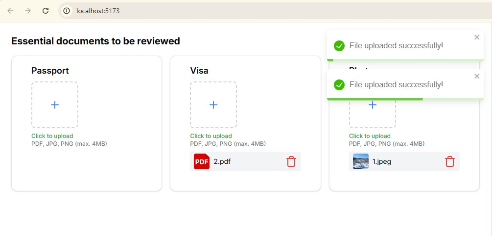

# Visa Document Uploader

A full-stack application to upload, preview, and manage visa-related documents such as **passport**, **visa**, and **photo**.



## ✨ Features

- Upload documents by category (`passport`, `visa`, `photo`)
- Generates thumbnails for image/PDF uploads
- Grouped file display by type
- File deletion with instant UI update
- RESTful API with Laravel v12
- Frontend built with React(Remix) + Tailwind CSS
- Fully typed with TypeScript
- Zod validation for strong schema enforcement
- Axios instance abstraction
- Toast notifications for feedback

---

## 🔧 Tech Stack

### Backend

- Laravel 12
- PHP 8.3
- Mysql
- Intervention Image (for thumbnails)

### Frontend

- React (Remix)
- Tailwind CSS
- Axios
- React Toastify
- Zod (validation)

---

## 🚀 Getting Started

### 1. Clone the repository

```bash
git clone https://github.com/0xbtxas/visa-uploader.git
cd visa-uploader
```

---

### 2. Setup Backend (Laravel)

```bash
cd file-api
composer install

# Create .env
cp .env.example .env

# Generate app key
php artisan key:generate

# Run DB migrations
php artisan migrate
```

To serve the API:

```bash
php artisan serve
```

✅ Available at `http://127.0.0.1:8000`

---

### 3. Setup Frontend (React/Remix)

In another terminal

```bash
cd visa-uploader-ui
npm install
```

Add your environment variable:

```env
# .env
cp .env.example .env
VITE_API_BASE_URL=http://127.0.0.1:8000/api
```

To run the frontend:

```bash
npm run dev
```

✅ Available at `http://localhost:5173`

---

## 🧪 Running Tests

### Laravel (PHPUnit)

```bash
php artisan test
```

### React (Vitest / Jest)

```bash
npm run test
```

---

## 🗂️ Project Structure

```
file-api/
│
├── app/
│   ├── Http/
│   │   ├── Controllers/Api/FileController.php
│   │   ├── Requests/UploadFileRequest.php
│   │   └── Resources/UploadedFileResource.php
│   ├── Services/FileService.php
│   └── Models/UploadedFile.php
├── tests/Unit/FileServiceTest.php
└── ...

frontend/
│
├── components/
│   ├── ui/
│   └── UploadSection.tsx
├── lib/
│   ├── api.ts
│   └── validation/
│       └── files.ts
├── types/
│   └── files.ts
├── routes/
│   └── VisaUploader.tsx
└── ...
```

---

## 🔒 Validation

- Backend: Laravel FormRequest + file size/type constraints
- Frontend: Zod schemas ensure strong structure (`uploadedFileSchema`, `fileGroupSchema`)
- Preview URLs are validated via `url()` in Zod

---

## 📦 Upload Behavior

- Files are stored under: `storage/app/uploads/{type}/`
- Thumbnails generated for images (100x100)
- PDFs use a fallback image (`fallbacks/pdf.png`)
- Thumbnail location: `storage/app/private/thumbnails/`

---

## 🤝 Contributing

1. Fork the repo
2. Create your branch: `git checkout -b feature/your-feature`
3. Commit your changes
4. Push to the branch: `git push origin feature/your-feature`
5. Open a pull request 🚀

---

## 📄 License

MIT © 2025
